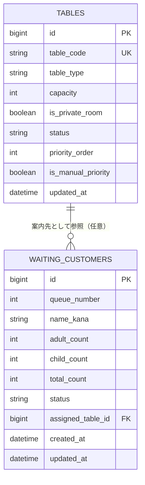

```mermaid

erDiagram
    TABLES {
        bigint id PK
        string table_code UK
        string table_type
        int capacity
        boolean is_private_room
        string status
        int priority_order
        boolean is_manual_priority
        datetime updated_at
    }

    WAITING_CUSTOMERS {
        bigint id PK
        int queue_number
        string name_kana
        int adult_count
        int child_count
        int total_count
        string status
        bigint assigned_table_id FK
        datetime created_at
        datetime updated_at
    }

    TABLES ||--o{ WAITING_CUSTOMERS : "案内先として参照（任意）"

```