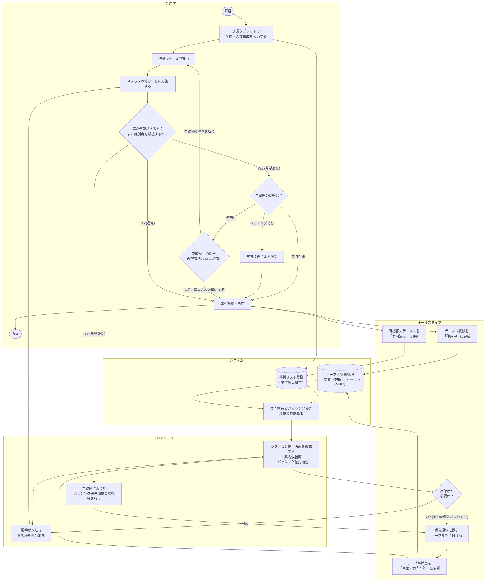

```mermaid
flowchart TD

    subgraph Customer [利用客]
        Start([来店]) --> InputReception[店頭タブレットで<br>名前・人数構成を入力する]
        InputReception --> Wait[待機スペースで待つ] 
        Wait --> CallRespond[スタッフの呼び出しに応答する]
        
        ConfirmPref{席の希望があるか？<br>または別席を希望するか？}
        ChoiceWait{空席なしの場合:<br>希望席待ち or 最初席?}
        
        CallRespond --> ConfirmPref
        ConfirmPref -- Yes (希望あり) --> CheckSeatStatus{希望席の状態は？}
        CheckSeatStatus -- 案内可能 --> GuideSeat[席へ移動・着席]
        CheckSeatStatus -- バッシング待ち --> WaitBussing[片付け完了まで待つ] --> GuideSeat
        CheckSeatStatus -- 使用中 --> ChoiceWait
        ChoiceWait -- 希望席の空きを待つ --> Wait
        ChoiceWait -- 最初に案内された席にする --> GuideSeat

        ConfirmPref -- No (通常) --> GuideSeat
        GuideSeat --> End([着席])
    end

    subgraph System [システム]
        RegData[(待機リスト登録<br>・受付順自動付与)]
        SeatStatus[(テーブル状態管理<br>・空席 / 使用中 / バッシング待ち)]
        CalcLogic[案内候補 & バッシング優先順位の自動算出]
        
        RegData --> CalcLogic
        SeatStatus --> CalcLogic
    end

    subgraph Leader [フロアリーダー]
        CheckScreen[システムの提示画面を確認する<br>・案内候補席<br>・バッシング優先順位]
        CallCustomer[順番が来たら<br>お客様を呼び出す]
        HandleException[希望席に応じた<br>バッシング優先順位の調整等を行う]

        CheckScreen --> CallCustomer
    end

    subgraph Hall [ホールスタッフ]
        CheckBussing{片付けが<br>必要か？}
        ExecuteBussing[優先順位に従い<br>テーブルを片付ける]
        UpdateSeatEmpty[テーブル状態を<br>「空席・案内可能」に更新]
        UpdateSeatUsing[テーブル状態を<br>「使用中」に更新]
        UpdateQueue[待機客ステータスを<br>「案内済み」に更新]
    end

    %% --- レーン間・フローの接続 ---
    InputReception --> RegData
    
    CalcLogic --> CheckScreen
    
    CheckScreen --> CheckBussing
    CheckBussing -- Yes (通常or例外バッシング) --> ExecuteBussing --> UpdateSeatEmpty --> SeatStatus
    CheckBussing -- No --> CallCustomer
    UpdateSeatEmpty --> CheckScreen

    CallCustomer --> CallRespond
    
    ConfirmPref -- Yes (希望あり) --> HandleException --> ExecuteBussing

    GuideSeat --> UpdateSeatUsing --> SeatStatus
    GuideSeat --> UpdateQueue --> RegData

    %% レーンの並びを安定させるための不可視リンク
    Customer ~~~ System ~~~ Leader ~~~ Hall

```