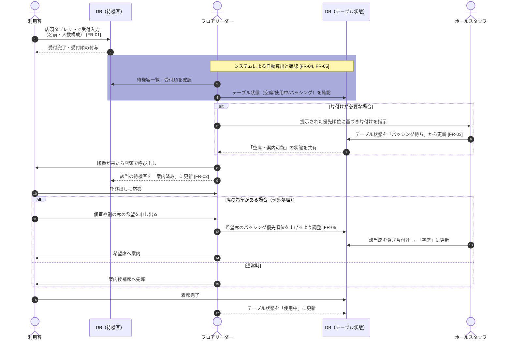

```mermaid
sequenceDiagram
    autonumber
    actor Customer as 利用客
    participant WaitDB as DB（待機客）
    actor Leader as フロアリーダー
    participant TableDB as DB（テーブル状態）
    actor Hall as ホールスタッフ

    %% 1. 受付フェーズ
    Customer->>WaitDB: 店頭タブレットで受付入力<br>（名前・人数構成） [FR-01]
    WaitDB-->>Customer: 受付完了・受付順の付与

    %% 2. 状態確認・判断フェーズ（ループ）
    rect rgb(168, 171, 219)
        Note over Leader, TableDB: システムによる自動算出と確認 [FR-04, FR-05]
        Leader->>WaitDB: 待機客一覧・受付順を確認
        Leader->>TableDB: テーブル状態（空席/使用中/バッシング）を確認
    end

    %% 3. バッシング・片付けフェーズ
    alt 片付けが必要な場合
        Leader->>Hall: 提示された優先順位に基づき片付けを指示
        Hall->>TableDB: テーブル状態を「バッシング待ち」から更新 [FR-03]
        TableDB-->>Leader: 「空席・案内可能」の状態を共有
    end

    %% 4. 呼び出し・案内フェーズ（通常 or 例外）
    Leader->>Customer: 順番が来たら店頭で呼び出し
    Leader-->>WaitDB: 該当の待機客を「案内済み」に更新 [FR-02]
    Customer->>Leader: 呼び出しに応答
    
    alt 席の希望がある場合（例外処理）
        Customer->>Leader: 個室や別の席の希望を申し出る
        Leader->>TableDB: 希望席のバッシング優先順位を上げるよう調整 [FR-05]
        Hall->>TableDB: 該当席を急ぎ片付け → 「空席」に更新
        Leader->>Customer: 希望席へ案内
    else 通常時
        Leader->>Customer: 案内候補席へ先導
    end

    %% 5. 着席完了フェーズ
    Customer->>TableDB: 着席完了
    Leader-->>TableDB: テーブル状態を「使用中」に更新
    

```