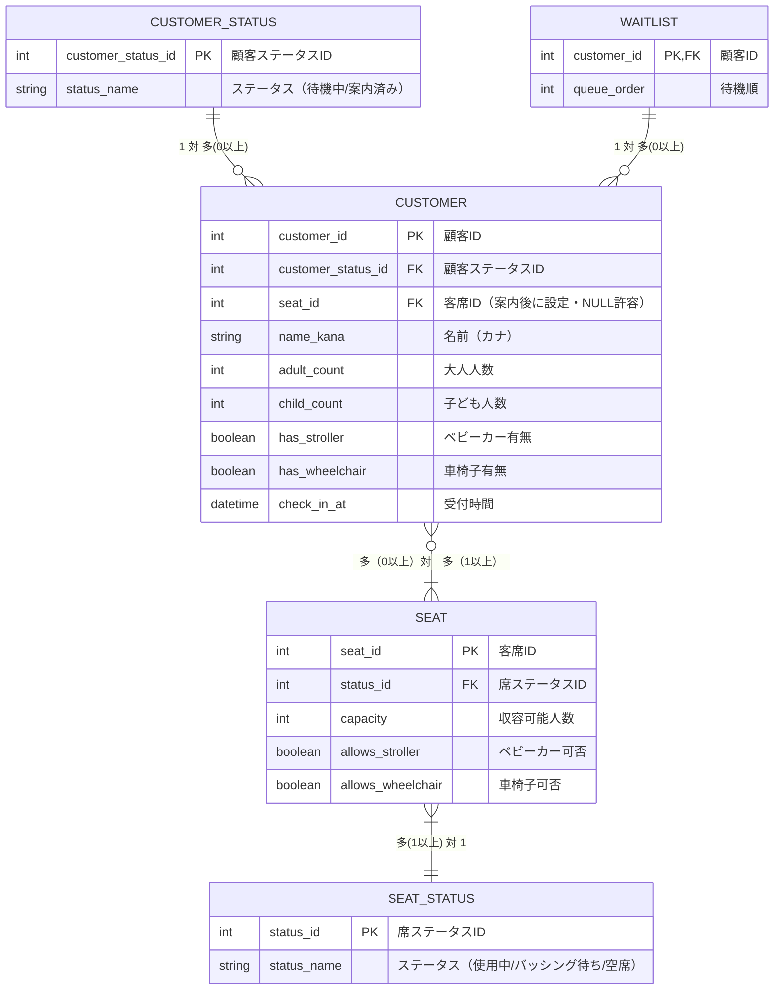

# DB設計

###  ER図

```mermaid

erDiagram
    CUSTOMER_STATUS ||--o{ CUSTOMER : "1 対 多(0以上)"
    WAITLIST ||--o{ CUSTOMER : "1 対 多(0以上)"
    CUSTOMER }o--|{ SEAT : "多（0以上）対　多（1以上）"
    SEAT }|--|| SEAT_STATUS : "多(1以上) 対 1"

    CUSTOMER_STATUS {
        int customer_status_id PK "顧客ステータスID"
        string status_name "ステータス（待機中/案内済み）"
    }

    WAITLIST {
        int customer_id PK,FK "顧客ID"
        int queue_order "待機順"
    }

    CUSTOMER {
        int customer_id PK "顧客ID"
        int customer_status_id FK "顧客ステータスID"
        int seat_id FK "客席ID（案内後に設定・NULL許容）"
        string name_kana "名前（カナ）"
        int adult_count "大人人数"
        int child_count "子ども人数"
        boolean has_stroller "ベビーカー有無"
        boolean has_wheelchair "車椅子有無"
        datetime check_in_at "受付時間"
    }


    SEAT {
        int seat_id PK "客席ID"
        int status_id FK "席ステータスID"
        int capacity "収容可能人数"
        boolean allows_stroller "ベビーカー可否"
        boolean allows_wheelchair "車椅子可否"
    }

    SEAT_STATUS {
        int status_id PK "席ステータスID"
        string status_name "ステータス（使用中/バッシング待ち/空席）"
    }

```
<!--
### テーブル一覧

### テーブル定義？
-->

