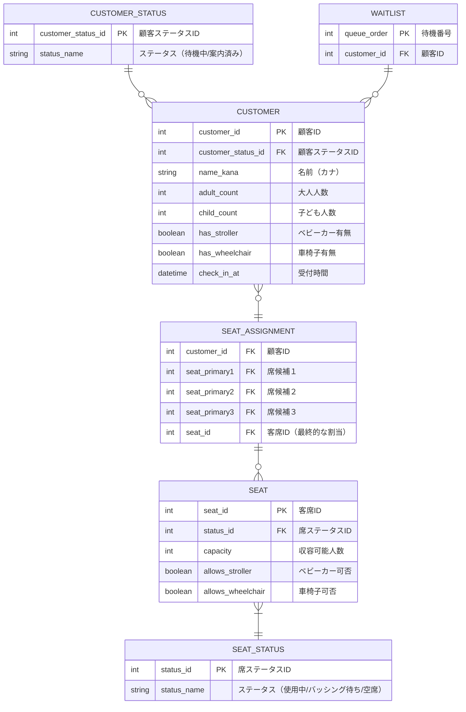

# DB設計

###  ER図

```mermaid

erDiagram
    CUSTOMER_STATUS ||--o{ CUSTOMER : ""
    WAITLIST ||--o{ CUSTOMER : ""
   
    CUSTOMER }o--|| SEAT_ASSIGNMENT : ""
    SEAT_ASSIGNMENT ||--o{ SEAT : ""
    SEAT }|--|| SEAT_STATUS : ""

    CUSTOMER_STATUS {
        int customer_status_id PK "顧客ステータスID"
        string status_name "ステータス（待機中/案内済み）"
    }

    WAITLIST {
        int queue_order PK "待機番号"
        int customer_id FK "顧客ID"
    }

    CUSTOMER {
        int customer_id PK "顧客ID"
        int customer_status_id FK "顧客ステータスID"
        string name_kana "名前（カナ）"
        int adult_count "大人人数"
        int child_count "子ども人数"
        boolean has_stroller "ベビーカー有無"
        boolean has_wheelchair "車椅子有無"
        datetime check_in_at "受付時間"
    }

    SEAT_ASSIGNMENT {
        int customer_id FK "顧客ID"
        int seat_primary1 FK "席候補１"
        int seat_primary2 FK "席候補２"
        int seat_primary3 FK "席候補３"
        int seat_id FK "客席ID（最終的な割当）"
    }

    SEAT {
        int seat_id PK "客席ID"
        int status_id FK "席ステータスID"
        int capacity "収容可能人数"
        boolean allows_stroller "ベビーカー可否"
        boolean allows_wheelchair "車椅子可否"
    }

    SEAT_STATUS {
        int status_id PK "席ステータスID"
        string status_name "ステータス（使用中/バッシング待ち/空席）"
    }

```

### 特徴：
　席割り当て用の中間テーブル（SEAT_ASSIGNMENT）を設けて席割り当て候補を参照できるようにした。\
　また、将来的には「席を結合して案内する」などの業務にも対応できるなどの拡張性を考慮した。
<!--
### テーブル一覧

### テーブル定義？
-->

