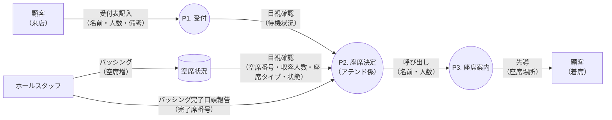

# 業務モデル図（DFD）

### ・レベル１：【アテンド業務】全体の流れ

以下に、アテンド業務全体の大まかな流れについてDFDを用いて示す。

```mermaid

flowchart LR
    %% 外部エンティティ
    E1[ 顧客<br>（来店）]
    E2[ ホールスタッフ]
    E3[ 顧客<br>（着席）]

    %% プロセス
    P1((P1. 受付))
    P2((P2. 座席決定 <br>（アテンド係）))
    P3((P3. 座席案内))

    %% データストア
    D7[( 空席状況)]
    

    %% データの流れ
    E1 -->|受付表記入<br>（名前・人数・備考）| P1
    P1 -->|目視確認<br>（待機状況）| P2

    E2 -->|バッシング<br>（空席増）| D7 
    D7 -->|目視確認<br>（空席番号・収容人数・座席タイプ・状態）| P2
    E2 -->| バッシング完了口頭報告<br>（完了席番号）| P2

    P2 -->|呼び出し<br>（名前・人数）| P3
    P3 -->|先導<br>（座席場所）| E3
    
```